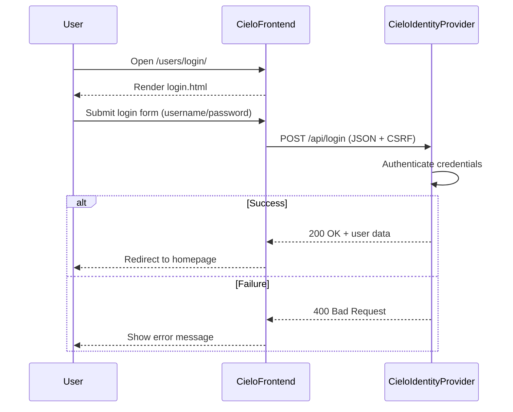

## CIELO Frontend Authentication Flow

This document describes how the CieloFrontend authenticates a user via the CieloIdentityProvider backend.

### Login Flow

1. **Login Page Rendering**
   The user visits the login page rendered by Django at `/users/login/` (template: `templates/users/login.html`).

2. **JavaScript-Driven API Call**
   A JavaScript file (`static/js/login.js`) captures the login form submission. It prevents the default form behavior and sends a `POST` request to `/api/login`, containing the username and password as JSON. The CSRF token is included in the request header.

3. **Backend Authentication**
   The `/api/login` endpoint is proxied or routed to the `CieloIdentityProvider`, where Django's `AuthenticationService` verifies credentials. If valid, Django's `login()` method creates a session and returns user details.

4. **Frontend Response Handling**
   If the login is successful, the frontend redirects the user to the homepage (`/`). If not, an error message is shown below the login form.

### Logout Flow

1. **Logout Request**
   JavaScript in `static/js/logout.js` sends a `POST` request to `/api/logout` using the stored session cookie and CSRF token.

2. **Session Termination**
   The identity provider receives the request and calls Django's `logout()` method to terminate the session.

3. **User Feedback**
   The frontend displays a logout confirmation page (`templates/users/logout.html`).

### Frontend Role

The CieloFrontend does not handle authentication directly. Instead, it:

* Renders HTML pages such as login, logout, and profile.
* Embeds JavaScript that interacts with the backend IdentityProvider over HTTP.
* Displays responses or redirects users based on authentication status.

This separation ensures a clear boundary between UI rendering and authentication logic.

### Sequence Diagram (Login Flow)

### Summary

* CieloFrontend is responsible for the user interface.
* CieloIdentityProvider performs session-based authentication via API.
* All credential handling is done securely on the backend.

This design allows CIELO to remain frontend-agnostic, enabling easy migration to a JavaScript SPA in the future if needed.

